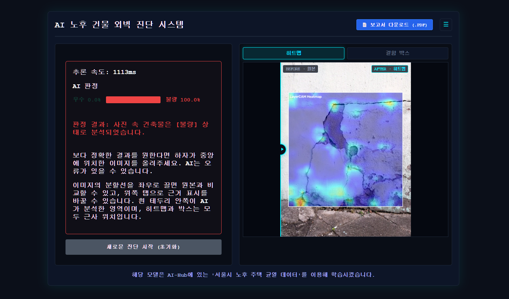

# 노후 건물 위험예측 프로젝트 — TEAM 날씨파티

> 건물 외관 이미지로 정상/결함을 분류하고 판단 근거를 시각화하는 4인 팀 프로젝트

이 저장소는 **팀 「날씨파티」의 노후 건물 위험예측 프로젝트를 이왕재의 포트폴리오로 정리한 사본**입니다. 팀이 함께 만든 서비스와 최종 결과를 먼저 소개하고, 이어서 제가 직접 수행한 데이터·모델 실험과 웹 구현 기여를 정리했습니다.

[팀 원본 저장소](https://github.com/gpwhdqkr/hn_old-building) · [노션 포트폴리오](https://app.notion.com/p/3c3b0908229881c086fcdc3eb8606e93)

## 팀 프로젝트 개요

| 항목 | 내용 |
|---|---|
| 프로젝트 | 노후 건물 위험예측 · 건물 외관 이미지 기반 노후 결함 진단 |
| 팀 / 인원 | 날씨파티 / 4명 |
| 기간 | 2026.07.16 ~ 2026.08.03 (WBS의 사전 준비는 07.15 시작) |
| 목표 | 육안 점검의 인력·비용·편차를 보완하기 위한 이미지 기반 결함 분류 및 결과 확인 서비스 |
| 최종 과제 | 정상(우수) / 결함(원본의 보통+불량) 이진 분류 |
| 데이터 | AI-Hub 서울시 노후 주택 균열 데이터 중 아파트 RGB 37,285장 |
| 서비스 | 사진 업로드, AI 분류, LayerCAM 시각화, 진단 이력, PDF 보고서 |
| 최종 모델 | ConvNeXt-Tiny, 입력 448×448 |

초기에는 우수·보통·불량 3등급 분류를 계획했습니다. 실험에서 '보통' 등급의 낮은 F1과 모호한 시각적 경계를 확인한 뒤, 팀의 최종 과제를 정상/결함 분류로 재정의했습니다. 프로젝트 명칭은 '위험예측'이지만 구현 결과는 외관 이미지의 결함 분류이며, 건물 전체의 구조 안전등급을 판정하는 시스템은 아닙니다.

## 서비스 화면과 이용 흐름

건물 외벽 사진을 올리면 AI가 정상/결함을 분류하고, 결과 화면에서 모델이 참고한 영역을 원본과 비교할 수 있는 웹 서비스입니다.



*기존 개인 포트폴리오 PDF 19쪽에 수록된 팀 서비스 시연 화면입니다.*

1. **사진 업로드** — 진단할 건물 외벽 이미지를 선택하거나 끌어다 놓습니다.
2. **판정 결과 확인** — 정상/결함 분류 결과와 모델 출력 확률을 확인합니다.
3. **판단 근거 비교** — 원본과 LayerCAM 히트맵을 슬라이더로 비교하고, 결함 박스 탭으로 표시 방식을 전환합니다.
4. **결과 활용** — PDF 보고서를 내려받거나 진단 이력에서 이전 결과를 다시 확인합니다.

화면의 확률과 추론 시간은 해당 시연 이미지 한 건의 결과입니다. 아래 최종 모델 평가 지표와 측정 범위가 다르며, 히트맵·박스는 모델이 참고한 영역을 보여주는 근사 표시입니다.


## 팀 구성과 역할 분담

| 팀원 | 최종 발표자료의 주요 역할 | WBS의 공동 작업 |
|---|---|---|
| 박혜준 (팀장) | 프로젝트 총괄, 일정 관리, 발표 | 실행환경·리소스 결정, 아키텍처 설계, 발표자료 |
| 이왕재 | 데이터 수집, 전처리, 모델 구축 | 김민권과 데이터 선정·수집·전처리·모델 선정·속도 테스트, 박혜준과 실행환경·리소스 결정·PPT 작성 |
| 김민권 | 데이터 전처리, 모델 구축 | 이왕재와 데이터 선정·수집·모델 비교·속도 테스트 |
| 최찬솔 | 백엔드, 프론트엔드 | 웹 화면 개발, 이미지 레이어와 그래프 작성 |

팀 역할표는 발표자료의 주요 분담을 나타냅니다. 아래 개인 기여에는 제가 실제로 수행한 웹 백엔드·프론트엔드 작업도 포함하며, 함께 작업한 팀원의 역할을 대체하는 단독 개발 실적으로 표현하지 않습니다.

## 팀 진행 과정

| 단계 | 주요 작업 |
|---|---|
| 기획 · 07.16 | 문제 정의, 데이터 선정, 3클래스 분류 설계 |
| 중간 발표 · 07.24 | Cloud GPU 환경 구축, 전통 ML과 CNN 전이학습 비교 |
| 개선 · 07.28 | Flask 추론 서비스, 증강·임계값 실험 |
| 최종 발표 · 08.03 | 이진 분류, 최종 전처리 재설계, ConvNeXt-Tiny 선정 |

GitHub로 코드를 관리하고 Notion으로 문서를 공유했습니다. 데이터·모델링은 이왕재와 김민권의 공동 담당으로 진행했고, 실행환경·리소스 결정과 발표자료 작성은 박혜준과 함께 수행했습니다. 전처리와 모델 실험 결과는 서비스의 최종 모델 선정 및 팀 발표 결과에 연결됩니다.

---

## 팀 최종 결과

| 지표 | 값 |
|---|---|
| 최종 모델 | **ConvNeXt-Tiny** (448 입력, 학습 시 결함 인지 크롭) |
| Accuracy | **98.54%** |
| Macro F1 | **0.9501** |
| 정상(우수) F1 | 0.9081 |
| 결함(불량) F1 | 0.9921 |
| 단일 추론 지연 | 4.48ms |
| 배치 처리량 | 359장/s |

최종 이진 분류 테스트 세트 5,676장(우수 448 / 불량 5,228) 기준입니다. [혼동행렬](test_results/binclf_v3/convnext_tiny/v3cta/test_confusion_matrix_finetuned.csv)에 기록된 정분류는 우수 410장, 불량 5,183장입니다. 지연·처리량은 발표자료의 실험 환경에서 측정한 모델 지표이며, 웹 요청 전체의 응답시간과 구분합니다.

**음영·저조도 강건성**: 인공 그림자와 저조도를 합성해 재평가한 결과, 최악 조건(강한 음영 + 저조도)에서도 Macro F1 하락이 **0.02 미만**(0.9501 → 0.9309)이었습니다. 합성 조건에 대한 평가 결과이며, 실제 모든 촬영 환경에서 같은 성능을 보장하는 결과는 아닙니다.

---

## 팀 서비스 구성과 기능

```
사용자 브라우저
    │  ① 사진 업로드 (drag & drop)
    ▼
Flask (app/main.py)
    │  ② 방어 가드 → 추론 요청
    ▼
추론 엔진 (app/ai_engine.py)
    │  ConvNeXt-Tiny · 입력 448 · 임계값 0.50
    │  LayerCAM으로 근거 영역 추출
    ▼
시각화 (app/cv_processor.py)
    │  OpenCV — 결함 박스 / 히트맵 오버레이
    ▼
    ├─▶ ③ 결과 조각 HTML 반환 → 화면에 주입 (페이지 이동 없음)
    └─▶ MongoDB (inspection_logs) — 진단 이력 저장
```

### 서비스에서 제공하는 기능

- **드래그 앤 드롭 업로드**와 진행률 애니메이션
- **before/after 비교 슬라이더** — 원본과 진단 결과를 겹쳐 놓고 좌우로 비교
- **레이어 탭** — 히트맵 뷰 / 결함 박스 뷰 전환
- **진단 이력** — 쿠키 기반 클라이언트 식별로 최근 20건 조회, 클릭 시 과거 결과 재현
- **PDF 진단 보고서 생성** — 판정 결과와 근거 이미지를 담은 보고서를 내려받기
- MongoDB 장애 시에도 화면 출력은 계속되도록 저장 로직을 try/except로 격리

### API

| 경로 | 메서드 | 설명 |
|---|---|---|
| `/` | GET | 메인 화면 |
| `/predict` | POST | 이미지 업로드 → 추론 → 결과 조각 HTML 반환 |
| `/history` | GET | 본인 진단 이력 최근 20건 (JSON) |
| `/history/<id>` | GET | 저장된 진단 1건 재현 (타인 기록은 404) |

---

## 개인 기여 — 이왕재

팀 내 주 담당은 **데이터 수집·전처리·모델 구축**입니다. 아래는 해당 역할과 함께 직접 수행한 서비스 구현을 포함한 기여 범위입니다.

| 영역 | 직접 수행한 내용 | 팀 결과와의 연결 |
|---|---|---|
| 데이터 수집·정제 | RGB 데이터 확보, IR 제외, JSON/JPG와 라벨 검증, 메타데이터 구성 | 학습·평가용 데이터 기반 마련 |
| 전처리·분할 | 촬영 그룹 단위 분리, 종횡비 유지, 448 입력, 결함 인지 크롭, 색상 증강 기준 | 누수 방지와 미세 결함 특징 보존 |
| 모델 실험 | 3클래스·이진 분류 비교, 백본 6종 및 CLAHE 변형, 임계값·음영·저조도 평가 | 최종 모델 선정 근거와 결과표 제공 |
| 웹 백엔드 | Flask 라우트, 추론 엔진 연결, MongoDB 진단 이력 저장·조회 | 학습 모델을 사용자 요청과 연결 |
| 웹 프론트엔드 | 결과 뷰어, 원본/결과 비교 슬라이더, 이력 사이드바 | 진단 결과와 과거 기록을 확인하는 화면 구현 |
| 공통 작업 | 실행환경·리소스 결정, PPT 초안·최종 작성 참여 | 일정 내 실험과 발표 준비 |

### 서비스 구현 기여

- `app/main.py`에서 이미지 요청을 추론 엔진에 연결하고, 진단 결과와 MongoDB 이력 저장·조회 흐름을 구현했습니다.
- `app/ai_engine.py`의 분류 결과와 LayerCAM 근거 영역을 웹 결과 화면에 연결했습니다.
- 결과 뷰어와 비교 슬라이더에서 원본·히트맵·결함 표시를 확인하고, 이력 사이드바에서 이전 진단을 다시 열 수 있도록 구현했습니다.
- 진단 결과를 PDF로 내려받는 기능과, DB 저장 실패를 화면 출력과 분리하는 처리를 구현했습니다.

## 개인 기여 상세: 문제 정의와 모델 개선

팀의 최종 모델 선정에 기여한 과제 재정의와 전처리·모델 비교 실험을 정리했습니다.

| 세대 | 과제 | 전처리 | 최고 모델 | Macro F1 | 병목과 전환 이유 |
|---|---|---|---|---|---|
| 1차 | 3클래스 (우수/보통/불량) | 224 정방형 | ResNet-18 캐스케이드 | 0.7054 | '보통' F1이 어떤 방법으로도 0.44를 못 넘음 → **이원화로 전환** |
| 2차 | 이원화 (정상/결함) | 224 정방형 | ResNet-50 | 0.8698 | 정상 501장 중 136장(27%) 오분류 → **전처리 재설계** |
| 3차 | 이원화 | **448 + 결함 인지 크롭** | **ConvNeXt-Tiny** | **0.9501** | 최종 |

세 단계는 분류 클래스와 전처리·분할 조건이 달라진 실험 경과입니다. 0.7054와 0.9501을 같은 과제·같은 테스트셋에서의 순수 모델 성능 향상률로 해석하지 않습니다. 학습은 결함 인지 크롭을 사용하고, 최종 평가는 512 리사이즈 후 448 센터크롭을 사용했습니다.

### 3클래스의 한계를 확인하고 이진 분류로 전환

3등급 분류에서 '보통' 클래스 F1이 0.44에서 정체했습니다. 오프라인 증강으로 '보통' 샘플을 늘려도, 로짓 bias를 보정해 recall을 끌어올려도 전체 Macro F1은 오히려 떨어졌습니다(0.6702 → 0.6224). '우수'와 '불량' 사이의 시각적 경계 자체가 모호하다고 판단해, 멘토 피드백을 반영하여 **정상 vs 결함 이원화**로 과제를 재정의했습니다.

### 입력 해상도와 크롭 방식 재설계

이원화로 Macro F1이 0.87까지 올랐지만, 정상 이미지의 27%를 결함으로 오판했습니다. 종횡비 왜곡과 결함 위치를 고려하지 않은 크롭을 개선 대상으로 판단했습니다.

| 항목 | 2차까지 | 3차 (v3) |
|---|---|---|
| 이미지 캐시 | 224×224 강제 리사이즈 (**종횡비 왜곡**) | 종횡비 유지, 짧은 변 768px |
| 학습 입력 | 224 | **448** (짧은 변 512 → 448 크롭) |
| 크롭 위치 | 결함 위치와 무관 | **결함 인지 크롭** — 어노테이션 bbox 중심 (지터 ±25%) |
| 색상 증강 | 밝기·대비 ±0.1 | 동일 + **색조·채도 변형 금지** (철근 노출의 녹 색 신호 보존) |
| 데이터 분할 | 등급별 층화 | 결함종류 × 이원화 라벨 층화 |

224 입력으로 축소하면 미세 균열의 특징이 약해질 수 있습니다. 해상도를 448로 올리고 크롭을 결함 위치로 유도하자 병목이던 정상 F1이 **0.7620 → 0.9081**로 뛰었습니다.

### 백본 6종과 CLAHE 변형 비교 (v3, 총 7개 실험)

| 실험 | 백본 | Accuracy | Macro F1 | 정상 F1 | 지연 | 처리량 |
|---|---|---|---|---|---|---|
| **v3cta** | **ConvNeXt-Tiny** | **98.54%** | **0.9501** | **0.9081** | 4.48ms | 359장/s |
| v3ctclahe | ConvNeXt-Tiny + CLAHE | 97.80% | 0.9283 | 0.8686 | 4.49ms | 360장/s |
| v3eb2a | EfficientNet-B2 | 97.87% | 0.9269 | 0.8654 | 7.02ms | 548장/s |
| v3r18a | ResNet-18 | 97.73% | 0.9242 | 0.8608 | **2.77ms** | **932장/s** |
| v3eb0a | EfficientNet-B0 | 97.71% | 0.9233 | 0.8590 | 4.94ms | 764장/s |
| v3r50a | ResNet-50 | 97.48% | 0.9168 | 0.8474 | 4.43ms | 403장/s |
| v3mv2a | MobileNet-V2 | 95.89% | 0.8755 | 0.7736 | 3.17ms | 1,080장/s |

- CLAHE 대비 향상은 **성능을 떨어뜨렸습니다** (0.9501 → 0.9283). 이 데이터에서는 이득이 없었습니다.
- ResNet-18은 Macro F1 0.9242를 지키면서 지연이 최소라 경량 배포 시 대안입니다.

---

## 기술 스택

| 영역 | 사용 기술 |
|---|---|
| 모델링 | PyTorch, torchvision, ConvNeXt / ResNet / EfficientNet / MobileNet |
| 설명가능성 | LayerCAM (grad-cam) |
| 데이터 | pandas, NumPy, scikit-learn, Pillow, OpenCV |
| 백엔드 | Flask 3.1, PyMongo |
| 보고서 | ReportLab (PDF 생성) |
| DB | MongoDB |
| 프론트엔드 | Vanilla JS (SPA 유사 구조), CSS |
| 학습 환경 | RunPod Cloud GPU |
| 배포 | Azure, GitHub Actions (저장소에는 Azure Web App 워크플로 포함) |

---

## 저장소 구조

```
├── app/                  # 웹 서비스 (백엔드 + 프론트엔드 전부)
│   ├── main.py           #   Flask 진입점, 라우트, MongoDB 저장
│   ├── ai_engine.py      #   추론 엔진, LayerCAM, 임계값 판정
│   ├── cv_processor.py   #   OpenCV 결과 시각화
│   └── templates/        #   HTML·CSS·JS (static/ 아님)
├── src/                  # 모델 학습·전처리 파이프라인
│   ├── v2/, v3/          #   세대별 전처리
│   ├── binclf/           #   이원화 분류 실험 (백본별)
│   ├── efficientnet/     #   3클래스 실험
│   └── offline_augmentation/
├── test_results/         # 실험 결과 (지표·혼동행렬·그래프)
├── docs/                 # 모델링 결과 문서, 구조 지도, 사용 설명서
├── data/                 # 메타데이터·분할 정의 (이미지 원본 제외)
└── model/                # 학습된 가중치
```

---

## 실행 방법

팀 발표자료의 아키텍처에는 Azure VM이, 이 개인 저장소의 배포 설정에는 Azure Web App이 기록되어 있습니다. 팀 발표 설계와 저장소의 배포 구성을 구분해 확인할 수 있습니다.

### 준비물

- Python 3.11+
- MongoDB (로컬 또는 원격)
- 학습된 모델 가중치 (`model/*.pth`) — 용량 문제로 저장소에 포함되지 않습니다

```bash
pip install -r requirements.txt
```

### 서버 실행

```bash
python app/main.py
```

`http://localhost:5000` 으로 접속합니다.

### 환경 변수

| 변수 | 기본값 | 설명 |
|---|---|---|
| `MONGO_URI` | `mongodb://localhost:27017/` | MongoDB 접속 주소 |
| `MODEL_THRESHOLD` | `0.50` | 결함 판정 임계값 |

---

## 데이터 출처

- **AI-Hub 「서울시 노후 주택 균열 데이터」** (데이터셋 번호 189), Training 파티션 전체
- 총 37,285장 / 촬영 그룹 1,715개 / 어노테이션 77,432개 (polygon 45,790, bbox 31,642)
- 원본에 포함된 열화상(IR)은 폴더명과 촬영 ID 이중 필터로 전량 제외하고 **RGB만** 사용
- 데이터 누수 방지를 위해 **촬영 영상 그룹 단위**로 70/15/15 분할 (그룹 중복 0건 검증)

> 원본 이미지 데이터는 AI-Hub 이용약관에 따라 이 저장소에 포함하지 않습니다.

---

## 한계와 다음 개선 과제

- **분류와 위치 표시의 구분**: LayerCAM은 모델이 참고한 영역을 시각화합니다. 정밀한 결함 위치·경계를 학습하는 객체 탐지 모델과는 다릅니다.
- **미적용 과제**: 흔들림 복원(Deblur), YOLO/Faster R-CNN 기반 정밀 위치 탐지, 결함 유형별 다중 분류는 시간·데이터 제약으로 적용하지 못했습니다.
- **평가 범위**: 합성 음영·저조도 실험은 해당 스트레스 조건의 결과입니다. 새로운 현장·촬영기기·건물에 대한 일반화는 추가 검증이 필요합니다.

## 개인 회고

같은 데이터도 전처리에 따라 학습 결과가 달라진다는 점을 확인했습니다. 증강과 임계값 조정만으로 해결되지 않던 문제를 과제 재정의와 입력 전처리 개선으로 다루며, 양질의 데이터 확보와 평가 기준 설정의 중요성을 배웠습니다. 팀의 역할 분담 안에서 데이터·모델 실험을 수행하고 서비스 구현에도 기여한 경험을 함께 정리했습니다.

## 자료와 근거

- 팀 최종 발표자료: **노후건물위험예측_최종발표_수정본22_10 1 (2).pptx**, 발표일 2026.08.03
- 역할 분담: 발표자료 2쪽, WBS 9쪽
- 데이터·전처리·모델 비교: 발표자료 10~22쪽
- 한계 및 개인 회고: 발표자료 26~27쪽
- [최종 전처리 파이프라인](src/v3/README.md)
- [최종 모델 혼동행렬](test_results/binclf_v3/convnext_tiny/v3cta/test_confusion_matrix_finetuned.csv)
- [팀 원본 저장소](https://github.com/gpwhdqkr/hn_old-building)

